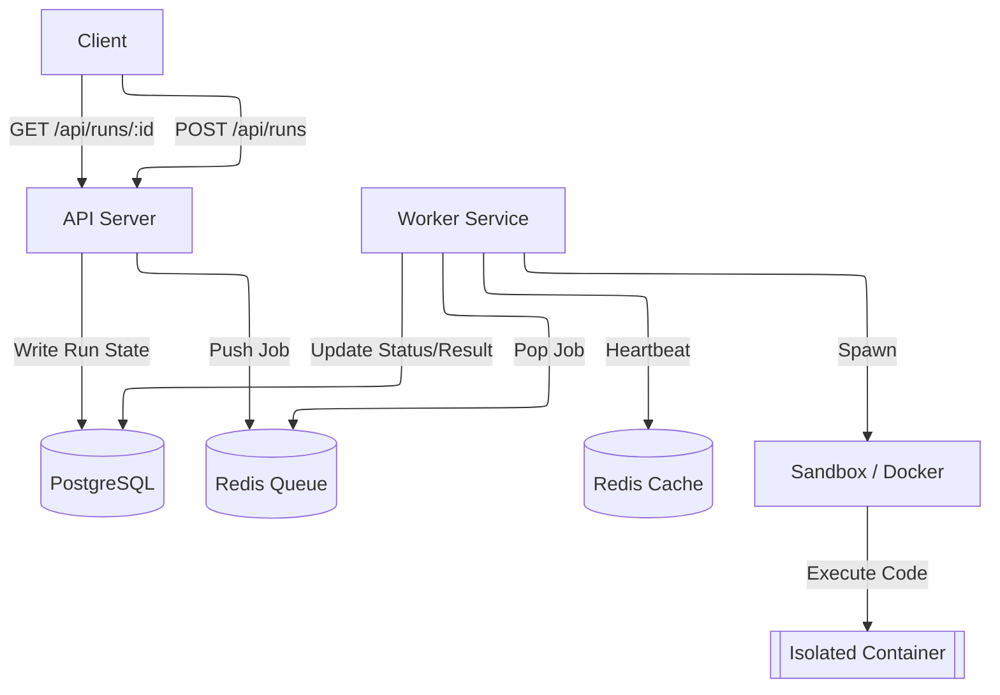
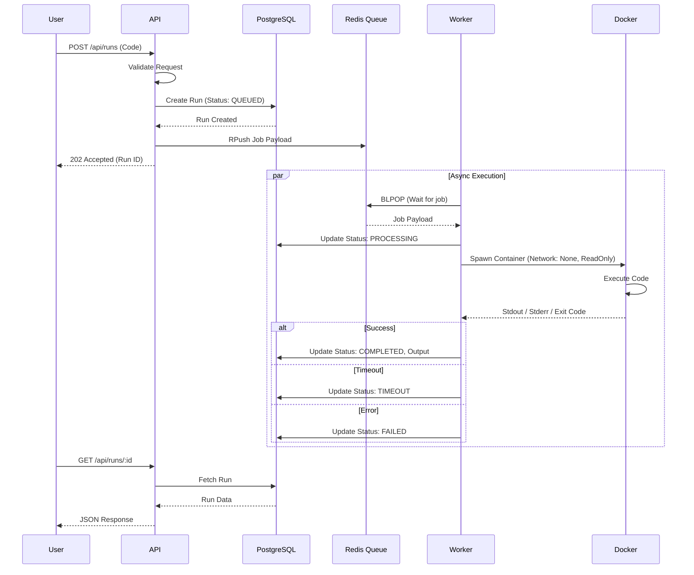

This document outlines the architecture and design of lambex. The system is desgined to safely execute untrusted user code in an isolated environment using workers

## High-Level Overview

The system consists of 3 main components:

1. **API Server:** Handles HTTP requests, validates input and manages the database state
2. **Redis:** Decouples the API from the execution workers, allowing for scalable processing
3. **Worker Service:** Consumes jobs from the queue and executes code within isolated Docker containers

---

## Components

### 1. **API Server**

It is an `Express.js` server responsible for:

- **Ingestion:** Receives code submissions via `POST /api/runs`
- **Validation:** Uses `zod` to validate language support and code length
- **Persistence:** Creates a `Run` record in PostgreSQL with an initial status of `Queued`
- **Queueing:** Pushes the job details to the Redis list defined by `QUEUE_NAME`

### 2. **Redis**

- **Redis List:** Used as FIFO queue to distribute workload among available workers
- **Redis Keys:**
    - `execution_queue`: The main list for pending jobs
    - `worker:{id}`: Ephemeral keys used for worker heartbeats and monitoring

### 3. **Worker Service**

A separate process that handles the heavy lifting of code execution. It supports concurrency via the `-c` flag

#### Lifecycle

1. **Startup:** Connect to Redis and PostgreSQL
2. **Heartbeat:** Periodically updates a Redis key to signal liveness and current status (`IDLE` or `BUSY`)
3. **Processing Loop:**
    - Block (`blPop`) waiting for a job
    - Updates DB status to `PROCESSING`
    - Invokes the **Sandbox**
    - Updates the DB with final output and status (`COMPLETED`, `FAILED`, `TIMEOUT`)

### 4. **Sandbox & Security**

- **Network Isolation:** `--network none` prevents external access
- **Read-Only Filesystem:** `--read-only` prevents writing to the root FS
- **Write Restriction:** Only `/tmp` is mounted as writable for temporary script storage
- **Resource Limits:** `--memory` limits RAM usage (default 128MB)
- **Timeout:** To kill Docker process if execution exceeds the limit (default 5s)
- **Ephemeral Containers:** `--rm` ensures containers are destroyed immediately after exit

---

## Execution Flow

---

## Database Schema

| Field         | Type          | Description                                                   |
| ------------- | ------------- | ------------------------------------------------------------- |
| id            | String (UUID) | Unique identifier for the run                                 |
| language      | String        | Programming language (e.g., 'javascript')                     |
| code          | Text          | The raw source code submitted                                 |
| status        | Enum          | Current state: QUEUED, PROCESSING, COMPLETED, TIMEOUT, FAILED |
| output        | Text          | stdout captured from the container                            |
| error         | Text          | stderr or system error messages                               |
| executionTime | Int           | Duration of execution in milliseconds                         |
